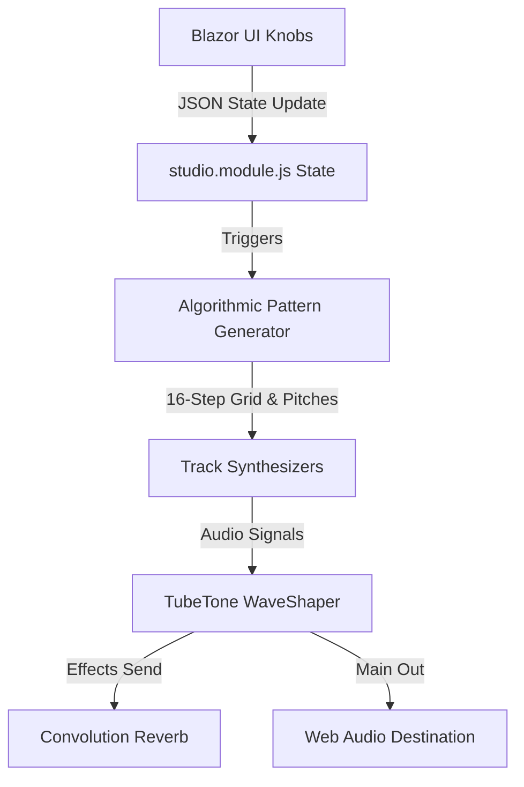

# The TubeTone Generative Groove Synthesis Engine (TTGSE)

This document details the architectural design, mathematical synthesis, and algorithmic generation mechanics powering the **TubeTone Generative Groove Synthesis Engine (TTGSE)** in [studio.module.js](file:///C:/dev/TEMPLATE/wwwroot/js/studio.module.js).

---

## 1. System Overview

Rather than relying on static audio loops or pre-defined sequencer grids, TTGSE uses **procedural scheduling** and **subtractive/physical-modeling synthesis** in the browser. 

The audio pipeline consists of:
1. **The Scheduler Loop**: A lookahead timer using Web Audio API's precise `currentTime` clock to achieve jitter-free scheduling.
2. **The Algorithmic Pattern Generator**: A system that dynamically evaluates vibe metrics and complexity values ($0.0 \le C \le 1.0$) to populate a 16-step trigger matrix on the fly.
3. **The Synthesizer Nodes**: Dynamic oscillators and noise generators modulated by procedural envelopes.
4. **The Spider TubeTone DSP Chain**: A wave-shaper simulation recreating non-linear hardware tube saturation.



---

## 2. Algorithmic Pattern Generation

Every time the vibe index or complexity knobs are adjusted, `generatePatterns()` evaluates procedural rules to build the beat grid.

### A. Kick Drum Pattern Generation
The Kick pattern adjusts density and syncopation according to `KickComplexity`:
* **Downbeat Base**: Step 0 always triggers.
* **Style Overrides**:
  * *Reggaeton/Dancehall*: Locks triggers to standard Dem Bow steps (0, 4, 8, 12).
  * *Jersey Club*: Employs the classic 5-kick bounce (0, 4, 6, 10, 14).
  * *Drill*: Focuses on offbeat syncopations (0, 10) and adds step 6 or 14 as complexity rises.
* **Trap/Boom Bap**: Basic downbeat is step 8. As complexity increases:
  * $C > 0.25$: Adds step 6.
  * $C > 0.55$: Adds step 11.
  * $C > 0.80$: Adds rapid double-triggering on steps 14 and 15.

### B. Snare Pattern Generation
Snare trigger rules handle half-time vs normal-time based on the vibe's style:
* **Half-Time (Trap/Drill/Rage/Phonk)**:
  * Snare triggers exclusively on step 8.
  * $C > 0.45$: Inserts a ghost-snare/roll on step 15.
  * $C > 0.75$: Adds syncopated fills on steps 3 and 12.
* **Standard Time (Boom Bap/Lofi/West Coast)**:
  * Snare triggers on backbeats: steps 4 and 12.
  * $C > 0.45$: Adds step 7.
  * $C > 0.75$: Adds steps 15 and 1.
* **Dem Bow Styles**: Forces syncopation on steps 3, 6, 11, and 14.

### C. Hi-Hat Division Logic
Hi-hat density scales mathematically:
* $C < 0.25$: Triggers quarter notes (every 4 steps).
* $0.25 \le C < 0.70$: Triggers eighth notes (every 2 steps).
* $C \ge 0.70$: Triggers sixteenth notes (every step).
* $C > 0.80$: Triplet rolls and stutter divisions are applied dynamically (adding extra triggers on steps 6, 7, 14, 15).

### D. Procedural Basslines & Melody
- **Pitches**: Determined dynamically by mapping midi offsets (e.g., Minor Pentatonic scale for Trap, Blues/Jazz shapes for Boom Bap) into frequencies:
$$f(n) = 440 \times 2^{\frac{n - 69}{12}}$$
- **Bass Slides**: For Drill vibes, when a trigger lands on steps where `step % 4 === 2`, the frequency glides exponentially up to $1.5\times$ base frequency:
`osc.frequency.exponentialRampToValueAtTime(freq * 1.5, time + 0.15)`
- **Melody Arpeggiation**: Scales chord density depending on `MelodyComplexity`. High complexity triggers octave jumps ($+12$ semitones) and fast arpeggios on even steps.

---

## 3. DSP Synthesis & TubeTone Emulation

### Non-Linear TubeTone Distortion
To recreate vintage hardware saturation, the synthesizers route their outputs through a WaveShaper Node containing a custom mathematical distortion curve:

```javascript
function getTubeToneCurve(driveVal) {
    const n_samples = 44100;
    const curve = new Float32Array(n_samples);
    const k = driveVal * 10;
    for (let i = 0; i < n_samples; ++i) {
        let x = (i * 2) / n_samples - 1;
        // Soft clipping with drive factor k
        curve[i] = (3 + k) * x * 20 * (Math.PI / 180) / (Math.PI + k * Math.abs(x));
    }
    return curve;
}
```

This math models soft-clipping analog tubes. As the complexity slider or the vibe's default drive parameter rises, the input signal is pushed harder into the curve, producing rich even-harmonic saturation.

---

## 4. Synthesizer Architectures

| Instrument | Oscillator/Source | Filter Type | Envelope Shape | Modulating Characteristics |
| :--- | :--- | :--- | :--- | :--- |
| **Kick** | Sine Wave | Lowpass | Fast Attack, Exponential Decay | Pitch sweeps from 150Hz down to 35Hz. Sub extends on higher complexity. |
| **Snare** | White Noise | Bandpass / Lowpass | Fast Attack, Short Decay | Reverb-drenched tail for Cloud vibes; low-passed muffled rim for Lofi. |
| **Hi-Hat** | White Noise | Highpass (9kHz) | Instantly decaying amplitude | Bright metallic sizzle or filtered shaker simulation. |
| **Bass** | Triangle / Saw | Lowpass | Warm Attack, Linear Decay | Gliding pitch envelope (slides) and wobbly Reese filter modulation. |
| **Melody** | Sawtooth / Sine | Peaking / Bandpass | Soft Attack, High Sustain | Mono-glide whistle (G-Funk), buzzy saw leads (Rage), or Rhodes EP simulation. |

---

## 5. UI Integration

The C# Blazor layer in [Studio.razor](file:///C:/dev/TEMPLATE/Pages/Studio.razor) binds to [StudioAudioState.cs](file:///C:/dev/TEMPLATE/Models/StudioAudioState.cs) and dispatches updates via [StudioService.cs](file:///C:/dev/TEMPLATE/Services/StudioService.cs). 

Whenever the patterns are computed, the JS engine invokes a JSInterop callback:
```javascript
dotNetHelper.invokeMethodAsync(gridCallback, audioState.grid, audioState.melodyNotes);
```
This pushes the 5x16 matrix back to C# instantly, allowing the read-only LED monitor grid to render the flashing steps in real-time.
